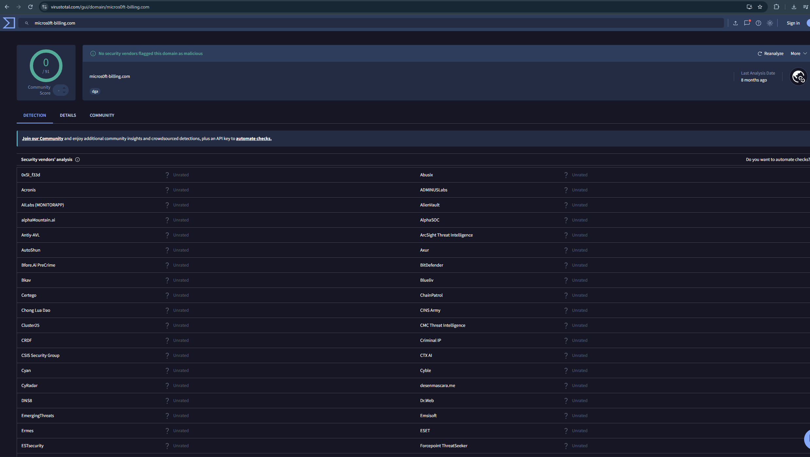
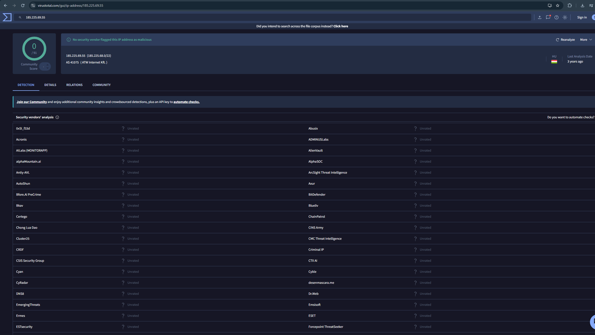
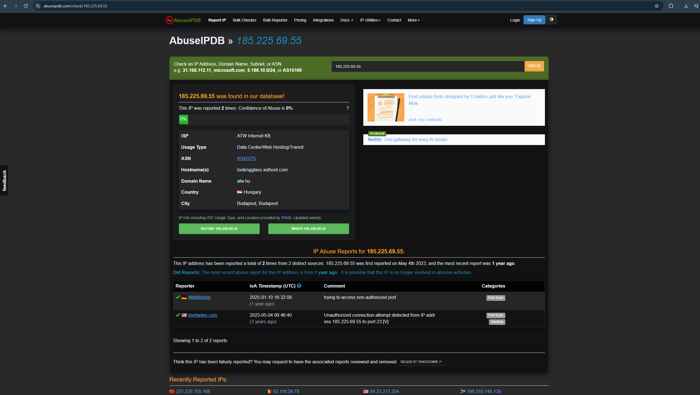
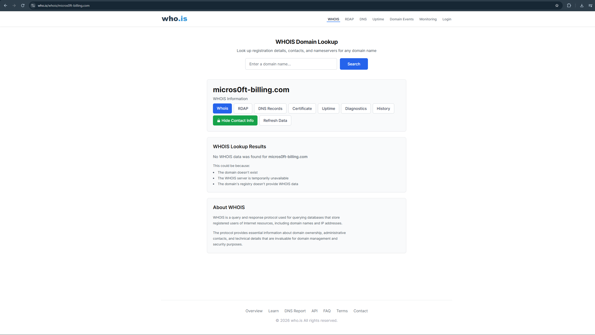

# IOC Analysis

## Objective

The purpose of this phase is to identify, extract, and enrich all Indicators of Compromise (IOCs) observed during the investigation. Public threat intelligence sources were used to provide additional context where available.

---

# Extracted Indicators

| IOC Type | Indicator | Assessment |
|----------|-----------|------------|
| Domain | micros0ft-billing.com | Suspicious |
| URL | hxxps://micros0ft-billing[.]com/invoice | Suspicious |
| IP Address | 185.225.69.55 | Suspicious |
| Sender Email | accounts@micros0ft-billing.com | Suspicious |
| Reply-To | support@micros0ft-billing.com | Suspicious |
| Attachment | Invoice_10482.docm | High Risk |

---

# Threat Intelligence Enrichment

The following public threat intelligence sources were consulted during the investigation:

- VirusTotal
- AbuseIPDB
- WHOIS

---

# VirusTotal Analysis

**IOC Investigated**

- Domain: micros0ft-billing.com
- IP Address: 185.225.69.55

### Findings

The investigated domain and IP address were not flagged as malicious by VirusTotal at the time of analysis.

This does **not** indicate that the infrastructure is legitimate. Newly created or previously unseen phishing infrastructure frequently has little or no public reputation.

The assessment remained suspicious based on independent evidence collected during the investigation.

### Evidence

#### VirusTotal Domain Lookup

#### VirusTotal IP Lookup

---

# AbuseIPDB Analysis

**IOC Investigated**

- IP Address: 185.225.69.55

### Findings

The IP address had historical abuse reports associated with unauthorized network activity.

Although the abuse confidence score remained low, previous reports indicate the address has been observed in suspicious activity.

Abuse reputation alone is insufficient to classify an indicator as malicious but provides valuable investigation context.

### Evidence

#### AbuseIPDB IP Reputation

---

# WHOIS Analysis

**IOC Investigated**

- Domain: micros0ft-billing.com

### Findings

A WHOIS lookup returned no registration information for the investigated domain.

The lack of registration data does not confirm malicious activity but increases suspicion when combined with the observed phishing indicators.

### Evidence

#### WHOIS Lookup

---

# Overall Assessment

Although public threat intelligence sources provided limited reputation data, the investigation identified multiple high-confidence phishing indicators, including:

- Typosquatted sender domain
- Failed SPF authentication
- Failed DMARC authentication
- Missing DKIM signature
- Brand impersonation
- Macro-enabled attachment
- Urgent payment request
- Finance department targeting

The combination of these indicators provides sufficient evidence to classify the email as a **high-confidence phishing attempt**, regardless of the absence of significant public reputation.

---

# Analyst Conclusion

Threat intelligence should support—not replace—technical analysis.

In this investigation, the phishing assessment was primarily based on email authentication failures, social engineering techniques, sender impersonation, and suspicious attachment characteristics rather than external reputation alone.
